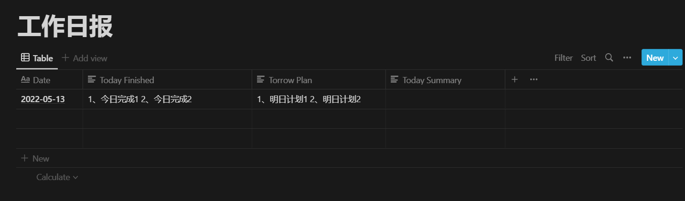

# DiaryRobot

## Installing
- You need install selenium drivers for browser from here, [http://docs.seleniumhq.org/download](http://docs.seleniumhq.org/download)
- Run follow command to installing library:
```
python -m pip install -r requirements.txt
``` 
## Config
You need:
- A Baidu OCR account, official page is [https://cloud.baidu.com/product/ocr_general](https://cloud.baidu.com/product/ocr_general), and active OCR features.
- A Notion API Key, get from here: [https://www.notion.so/my-integrations](https://www.notion.so/my-integrations)
- A Notion Database page like this: , should share to integration of last step.

then modifiy the robot.json file
```
{
    "oa_user": "NuoNuo OA User Name",
    "oa_pwd": "NuoNuo OA User Password",
    "baidu_client_id": "Baidu OCR API Client ID",
    "baidu_client_secret": "Baidu OCR API Client Secret",
    "notion_api_key": "Notion API Key",
    "notion_database_id": "Notion Diary Page Database ID",
    "cc": [
        "Name1",   
        "Name2",
        "Name3",
        .....
    ]
}
```

## Run
```
python robot.py
# or
python robot.py robot.json
```

Enjoy :)